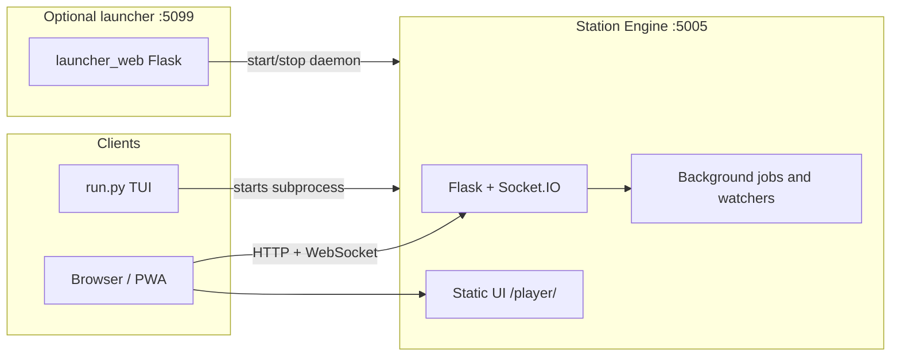

## ARQUITECTURA – Descripción general del sistema

Este documento describe cómo está estructurado el repositorio Soundsible, qué procesos se ejecutan, dónde y cómo fluyen los datos entre los componentes. Para obtener detalles sobre la implementación y la conexión en red, consulte [INSTALL.md](INSTALL.md); para perillas y variables de entorno, consulte [CONFIGURATION.md](CONFIGURATION.md).

### 1. modelo mental

Soundsible es un **entorno de música autoalojado**: un **Station Engine** Python expone una API HTTP y eventos en tiempo real, brinda servicio a la interfaz de usuario web de **Station** y coordina la administración de la biblioteca, el estado de reproducción y las descargas. Un **lanzador web** opcional independiente ayuda a iniciar el demonio heredado desde un navegador. Los flujos **CLI** opcionales utilizan los mismos puntos de entrada del motor.

En tiempo de ejecución, normalmente tienes uno de estos modos de motor:

- **Demonio heredado**: un proceso escuchando en el **puerto 5005** de forma predeterminada (`STATION_PORT` en `shared/constants.py`). Ejecuta Flask, Socket.IO (modo asíncrono **gevent**) y trabajo en segundo plano (cola de descarga, observadores de archivos, sincronización de biblioteca opcional).
- **Motor de escritorio**: un proceso iniciado con `run.py --desktop-engine` o `soundsible_engine.py`. Se vincula a **`127.0.0.1` en un puerto libre aleatorio de forma predeterminada**, escribe el estado de ejecución en el directorio de configuración de la aplicación y emite una única línea de preparación JSON en la salida estándar antes de los registros de inicio normales.
- **Lanzador web**: aplicación Flask opcional en el **puerto 5099** (`start_launcher.py` / `launcher_web/`). **No** sirve al reproductor; solo ayuda a arrancar o detener el motor y ejecutar la interfaz de usuario de configuración por primera vez.

La interfaz de usuario de **Station** es una aplicación SolidJS responsiva en `ui_web/`, atendida por el motor en **`/player/`** y **`/player/desktop/`**. Ambas rutas utilizan la misma interfaz; la ruta del escritorio recibe además el arranque del token de propietario requerido por el shell del escritorio. La interfaz de usuario se comunica con el motor a través de REST y WebSocket (Socket.IO).

### 2. Diseño del repositorio (nivel alto)

| Área                   | Rol                                                                                                                                                           |
| ---------------------- | ------------------------------------------------------------------------------------------------------------------------------------------------------------- |
| `run.py`               | Entrada universal: venv bootstrap, menú opcional **TUI**, heredado **`--daemon`** o escritorio **`--desktop-engine`**.                                        |
| `soundsible_engine.py` | Punto de entrada del motor de escritorio independiente que incluye `run.py --desktop-engine`.                                                                 |
| `shared/`              | Código transversal: aplicación API Flask (`shared/api/`), modelos, rutas de configuración, ayudantes de seguridad, acceso a SQLite, orquestación de trabajos. |
| `player/`              | Administrador de biblioteca, cola, favoritos, caché: lógica de **reproducción principal y biblioteca** utilizada por la API.                                  |
| `ui_web/`              | SolidJS + interfaz de TypeScript Station y compilación Vite; incluye **Descubrir** (metadatos Deezer + resolución YouTube).                                   |
| `launcher_web/`        | Pequeña aplicación Flask para las páginas de inicio y la API de “iniciar/detener ecosistema”.                                                                 |
| `odst_tool/`           | Canalización de descargas (yt-dlp, FFmpeg), formato de biblioteca ODST, ayudantes de sincronización en la nube; integrado en la API para descargas.           |
| `setup_tool/`          | Proveedores de almacenamiento (local, compatible con S3), escaneo, cargas, ayudas de audio/cubierta utilizadas por la biblioteca y rutas de sincronización.   |

### 3. Vista de procesos y redes



- **Iniciando el demonio heredado**: `shared/daemon_launcher.py` genera `venv` Python con `run.py --daemon`, que llama a `shared.api.start_api()` y se vincula a **0.0.0.0:5005**.
- **Iniciando el motor de escritorio**: `soundsible_engine.py` o `run.py --desktop-engine` construye un `RuntimeConfig`, crea un archivo de token de propietario corto más un token de autenticación con alcance coincidente, escribe `desktop-engine-state.json` en el directorio de configuración y luego inicia `shared.api.start_api()` en la interfaz de loopback.
- **CORS**: Los valores predeterminados de REST CORS permiten rangos de estilo localhost, LAN privada y Tailscale a menos que `SOUNDSIBLE_ALLOWED_ORIGINS` los anule. Socket.IO CORS se puede apretar con `SOUNDSIBLE_SOCKET_CORS_ORIGINS`.

### 4. Partes internas del motor de la estación

La aplicación Flask se encuentra en `shared/api/__init__.py`. Eso:

- Registra planos para **biblioteca**, **reproducción**, **descargador**, **config**, **descubrimiento**, **podcasts** y **agente** (`shared/api/routes/`).
- Sirve el reproductor web en `/player/`: prefiere la compilación `ui_web/dist` cuando está presente, recurriendo al árbol de fuentes `ui_web` (anular con `SOUNDSIBLE_WEB_UI_DIST=0/1`).
- Contiene singletons para **LibraryManager**, **QueueManager**, **FavouritesManager** y el subsistema de descarga.
- Utiliza **Socket.IO** para actualizaciones en vivo (por ejemplo, cambios en la biblioteca, progreso del descargador, coordinación de reproducción).

**Contrato de sidecar de escritorio**:

- El motor de escritorio emite un evento de preparación JSON delimitado por nueva línea en la salida estándar con `base_url`, `host`, `port`, `pid`, `version`, `health` y `owner_token_file`.
- El estado de tiempo de ejecución se refleja en `desktop-engine-state.json` en el directorio de configuración para que un futuro shell de escritorio pueda detener solo el proceso de propiedad mediante PID en lugar de eliminarlo por puerto.
- `GET /api/health` devuelve directorios de tiempo de ejecución, tiempo de actividad, ruta del archivo del token del propietario, estadísticas de la biblioteca y estado activo del trabajo en segundo plano para el diagnóstico del shell.
- `/player/desktop/` ahora recibe el token de propietario a través de la inyección de arranque HTML (`meta` + `window.__SOUNDSIBLE_OWNER_TOKEN__`) para que el reproductor de escritorio pueda llamar a rutas protegidas por el propietario sin hacks de cadenas de consulta.

**Primitivas de emparejamiento**:

- Los propietarios crean sesiones de emparejamiento de corta duración con **`POST /api/pairing/sessions`** y pueden inspeccionarlas con **`GET /api/pairing/sessions`**.
- Las datos de los mensajes de sesión ahora incluyen metadatos de conexión listos para QR: URL base de LAN candidatas, URL de reclamación/reproductor y una carga útil JSON `qr_text` compacta adecuada para codificar directamente en un código QR.
- Los clientes reclaman un código de emparejamiento visible a través de **`POST /api/pairing/sessions/claim`**.
- Los propietarios completan o cancelan el flujo a través de **`POST /api/pairing/sessions/<id>/confirm`** y **`POST /api/pairing/sessions/<id>/cancel`**.
- El shell puede marcar explícitamente la hoja QR abierta o cerrada mediante **`POST /api/pairing/sessions/<id>/display-open`** y **`POST /api/pairing/sessions/<id>/display-close`**. Si `auto_confirm` está habilitado mientras la pantalla está abierta, un reclamo puede completarse inmediatamente sin un segundo viaje de ida y vuelta del propietario.
- La confirmación exitosa crea un token de portador `paired_device` con alcance en `auth_tokens`; los propietarios pueden enumerar y revocar esos tokens con **`GET /api/paired-devices`** y **`POST /api/paired-devices/<token_id>/revoke`**.
- El motor expone este flujo, pero conectarlo a la vista Configuración SolidJS sigue siendo una tarea de paridad `new-ui` antes de la transición.

**Orquestación de trabajos** (`shared/api/orchestrator.py`): un pequeño **JobOrchestrator** serializa las escrituras de metadatos y ejecuta trabajos simultáneos limitados (por ejemplo, descargas) para que las tareas pesadas no acaben con la biblioteca.

**Almacenamiento en caché y vuelo único** (`shared/api/memo.py`): cada ruta lenta en la API es una llamada yt-dlp medida en segundos: búsqueda de texto, resolución de URL de transmisión, combinaciones relacionadas. `Memo` les proporciona un caché TTL **limitado** más un **vuelo único**: las personas que llaman simultáneamente para una clave se colapsan en la que llegó primero y comparten su resultado. Esto es importante porque un caché TTL solo ayuda *después* de que regresa la primera llamada; mientras está en vuelo, la entrada está ausente, por lo que N solicitudes simultáneas de la misma cosa pagan el precio completo. Esa es exactamente la forma de un oyente que toca una vista previa repetidamente, o una búsqueda previa especulativa que acelera el clic que debía hacer instantáneo. Utilizado por:

| Camino                                                            | TTL                   | Notas                                                                                                                         |
| ----------------------------------------------------------------- | --------------------- | ----------------------------------------------------------------------------------------------------------------------------- |
| `_get_preview_stream_url_cached` (reproducción)                   | 5 min, 20 s negativo  | Un vídeo que no se puede resolver se recuerda brevemente, por lo que una tormenta de reintentos no es una tormenta de yt-dlp. |
| `_resolve_candidates` (catálogo)                                  | 30 s                  | Sólo ventana de vuelo; el caché duradero es SQLite `get_cached_resolution`.                                                   |
| `youtube/search`, `youtube/peek`, `youtube/related` (descargador) | 5 min / 1 min / 5 min | `related` también vuelve a verificar el caché persistente de SQLite dentro del vuelo.                                         |

La resolución del catálogo pone en cola la resolución de la URL de transmisión del ganador en el **trabajador de captación previa de vista previa** en lugar de bloquear la respuesta: el clic que sigue encuentra la URL activa o se une a la extracción que ya se está ejecutando.

**Ruta de descarga**: los elementos en cola se procesan en segundo plano; Las pistas completadas se fusionan en los metadatos de la biblioteca principal (`_sync_odst_to_main_core` y ayudantes relacionados). Un MBID de grabación de catálogo cruza la cola como evidencia de adquisición, se almacena en la pista y se incrusta utilizando el mapeo de etiquetas MP3/FLAC estándar de MusicBrainz Picard; Los análisis de carpetas recuperan el mismo identificador de los archivos etiquetados compatibles. FFmpeg e yt-dlp se utilizan a través de `odst_tool/`.

**Ruta de la biblioteca**: `player/library.py` carga los canónicos **`library.db`** y **`~/.config/soundsible/config.json`** de cada cuenta para `PlayerConfig`; también puede utilizar proveedores de almacenamiento de `setup_tool/` para exportaciones respaldadas en la nube. Una transacción SQLite almacena la instantánea completa de la biblioteca: pistas y listas de reproducción ordenadas, configuraciones, estado del podcast, `artists`/`albums`/`track_artists` normalizado y `track_user_state`. Los ID de entidad son deterministas y los álbumes incluyen al artista del álbum, por lo que los registros no relacionados con el mismo título no colapsan. Después de que se confirma esa transacción, Soundsible actualiza atómicamente `library.json` como una exportación portátil; un error de exportación no revierte la biblioteca.

Cada pista lleva **`added_at`**, el día en que la canción se unió a *esta* biblioteca: establecida por cada ruta de adquisición, transmitida a través de una identificación reintroducida y nunca reescrita una vez almacenada. Es lo que significa "agregado recientemente" en el reproductor, en el `newest` de `getAlbumList2` y en el `created` de un álbum de Subsonic. Una biblioteca anterior a la existencia de la columna tiene fecha una vez, al abrirse, desde el propio mtime de cada archivo, y vuelve a su posición en el manifiesto de un archivo al que no se puede acceder; `last_updated` no se utiliza deliberadamente, porque cada fila lleva el instante de la última reescritura. El reproductor fusiona archivos con canciones guardadas pero no descargadas en este campo, que es la única forma en que una biblioteca que contiene ambas puede ordenarse por cualquier cosa excepto por la lista en la que se encuentra una canción.

`POST /api/library/scan` pone en cola un análisis con ámbito de cuenta en la línea de fondo limitada en disco del orquestador. Lee las raíces musicales configuradas en su lugar y fusiona su delta con la revisión más reciente de SQLite bajo el bloqueo de metadatos serializados, por lo que un escaneo no puede sobrescribir una descarga simultánea. Las rutas absolutas y los tiempos de archivo siguen siendo campos SQLite locales de la máquina y están excluidos de `library.json`. La reproducción los acepta solo mientras sus objetivos resueltos permanezcan dentro de una raíz configurada actualmente. Los nuevos escaneos agregan o cambian la clave de los archivos, pero nunca eliminan los que faltan; la eliminación sigue siendo una acción de mantenimiento explícita.

**Exploración del catálogo**: `shared/api/routes/library_catalog.py` sirve `/api/library/albums`, `/api/library/artists`, `/api/library/genres` y `/api/library/years` desde esa misma proyección normalizada, por lo que el reproductor explora los registros y los créditos que explora `/rest` en lugar de reagrupar el manifiesto plano en el navegador, lo que convirtió una cadena de visualización en un intérprete y fusionó dos registros que comparten un título. Los pedidos de álbumes se validan con respecto a `DatabaseManager.ALBUM_ORDERINGS`, la tabla por la que se ordena `getAlbumList2`, por lo que las dos superficies no pueden estar en desacuerdo sobre lo que significa "por año". Las entidades responden con identificadores de pistas: el reproductor ya tiene todas las pistas que puede reproducir, codificadas por identificación, con su marca favorita y lectura de volumen adjunta.

Una cuenta sin un marcador canónico se migra una vez utilizando la precedencia manifiesta anterior. Su manifiesto config-dir se conserva como `library.json.pre-sqlite.bak`; Las cuentas nuevas reciben una base de datos canónica vacía. Después de la migración, las ediciones JSON y los mtimes se ignoran: se observan otros escritores durante la revisión SQLite y `/api/library/sync` recarga SQLite y regenera las exportaciones.

**Ruta OpenSubsonic**: `shared/api/routes/subsonic.py` sirve a `/rest`, leyendo ese mismo catálogo y sirviendo bytes a través de la ruta que usa `/api/static/stream`. `shared/subsonic/` contiene lo que las vistas deciden: el sobre XML/JSON/JSONP, la credencial por cuenta (cifrada, porque el protocolo de enlace `md5(password + salt)` no se puede comparar con un hash), los serializadores `Child`/`AlbumID3`/`ArtistID3` y la transcodificación ffmpeg. Esta superficie está **fuera de `/api`**, por lo que el gancho `before_request` la deja anónima y se autentica, sin ningún atajo de red confiable, ya que se puede acceder a ella a través de un embudo. Consulte [OpenSubsonic](OPENSUBSONIC.md).

**Registro y transferencia de dispositivos**:

- Los clientes se registran con **`POST /api/devices/register`** usando `device_id`, `device_name` y `device_type` (`mobile`, `desktop` o `agent`). El registro es local del proceso y su alcance se realiza a través del mismo solucionador de alcance de reproducción que el estado de reproducción.
- Los clientes de Socket.IO aún se unen a salas **`playback:{scope}:{device_id}`** a través de `playback_register`; ese evento también actualiza el registro de los clientes web existentes.
- El estado de reproducción permanece aislado por `scope` y `device_id`. Los clientes publican el estado con **`PUT /api/playback/state`** y las solicitudes de detención usan **`POST /api/playback/notify-stop`**.
- **`POST /api/playback/handoff`** lee el estado del dispositivo de origen, emite `playback_stop_requested` a `playback:{scope}:{from_device_id}`, escribe el estado del dispositivo de destino con el asistente de estado de reproducción existente y emite `playback_start_requested` a `playback:{scope}:{to_device_id}`. No transmite a través de ámbitos ni salas sin ámbito.

**API del agente**:

- Los tokens de agente se crean con **`POST /api/agent/token`**. Esta ruta está protegida por el administrador utilizando la misma política que otras rutas de administrador (`SOUNDSIBLE_ADMIN_TOKEN` cuando está configurada; de lo contrario, compatibilidad confiable con LAN/Tailscale).
- Los tokens de autenticación con alcance se almacenan en SQLite `auth_tokens` únicamente como hashes. El motor de escritorio usa un token `owner` y los agentes usan tokens `agent` con alcance. Las rutas de agentes heredadas aún conservan la compatibilidad con la tabla `agent_tokens` anterior.
- Los agentes se autentican con `Authorization: Bearer <token>` o `X-Soundsible-Agent-Token`.
- **`GET /api/agent/verify`**, **`POST /api/agent/play`** y **`POST /api/agent/command`** requieren `@require_agent_token`.
- El control del agente se dirige a un `device_id` suministrado o al dispositivo que no es agente registrado más recientemente en el alcance actual. Los comandos se emiten a las salas `playback:{scope}:{device_id}` y reutilizan el estado de reproducción para inicios estilo `play`/handoff.

**Buscar proveedores y fuentes de descubrimiento** (`shared/api/routes/discovery.py`, `shared/discovery_intelligence.py`):

- El navegador no puede llamar a `api.deezer.com` (CORS). La estación expone **`GET /api/discovery/deezer/<path>`**, que reenvía rutas **listas permitidas** de Deezer únicamente (por ejemplo, `chart`, `search`, `playlist/<id>`, `track/<id>`, `artist/<id>/top`) y devuelve el JSON de Deezer sin cambios.
- Las solicitudes tienen **velocidad limitada** por IP (`discovery_deezer`). El motor necesita **HTTPS saliente** a Deezer.
- **`GET /api/discovery/music/feed`** es un contrato de descubrimiento clasificado interno. Reúne candidatos relacionados con biblioteca local, favoritos, lista de reproducción, historial de escucha, Deezer y YouTube en caché; Luego, el servidor clasifica las secciones, diversifica a los artistas y elimina los duplicados de las secciones transversales. Se devuelve un resultado local sin esperar la extracción del proveedor, mientras que la respuesta más completa se actualiza en segundo plano y se entrega obsoleta mientras se revalida.
- Los grupos de descubrimiento de reproducción pueden consumir ese contrato sin cambiar la presentación de **Búsqueda** existente. **Biblioteca** sigue siendo la ruta raíz.
- **`POST /api/discovery/music/plan`** es el contrato de escucha generada para reproducción automática, radio y Auto Mode. La estación reúne candidatos locales reproducibles, relacionados con semillas, listas de éxitos en caché y artistas, aplica el perfil de la cuenta, la diversidad, las exclusiones y la política de intención/perfil, y luego devuelve el segmento final ordenado. Un único coordinador de navegador es responsable de la cancelación, los reintentos y la recarga; nunca vuelve a clasificar la respuesta del servidor.
- La radio sigue siendo el modo explícito de “más de esto ahora” y se recarga continuamente. Auto Mode utiliza el contrato de composición v6: las elementos del recorrido determinan lo que sonará, mientras que las fuentes efímeras visibles dirigen de forma independiente la recorrido generado. Las fuentes se acumulan con la ponderación decreciente según su antigüedad; Las pistas escuchadas proporcionan un contexto continuo de un solo salto solo después de que realmente suenan. La ubicación exacta y las exclusiones siguen siendo locales de la sesión, sin estado de punto de referencia ni límite musical estricto. El director construye un arco de energía a partir del análisis de señales y recorridos de gráficos estocásticos; no utiliza un LLM ni aplica silenciosamente el perfil de gusto global de la cuenta. La reproducción automática sigue siendo una continuación invisible de contexto finito. La búsqueda no utiliza el planificador de colas y su interfaz de usuario no cambia.
- **La reproducción y descargas** para esas filas **no** usan audio Deezer. La interfaz de usuario ejecuta **búsqueda de texto YouTube / YouTube Music** (la misma ruta ODST `/api/downloader/youtube/search` que el descargador) usando el título + artista de Deezer, selecciona una identificación de video coincidente y luego:
  - **Vista previa en la aplicación** se transmite a través de **`GET /api/preview/stream/<video_id>`** (modelo de reproducción).
  - **Cola de descarga** utiliza el elemento resuelto como cualquier otro resultado de búsqueda ODST.
- La resolución puede tardar unos segundos; la ventana emergente de la cola de descarga puede mostrar un breve estado **“Encontrando coincidencia YouTube…”** mientras se ejecuta la búsqueda.

**Búsqueda universal** (`shared/api/routes/catalog.py`):

- `GET /api/catalog/search` ejecuta la biblioteca, Deezer, MusicBrainz y los proveedores simples YouTube simultáneamente y devuelve una lista mixta clasificada de manera determinista. Las fallas del proveedor se reportan como fallas parciales; Los resultados supervivientes siguen siendo utilizables.
- La clasificación es sólo de consulta. Nunca lee señales de recomendación, favoritos o preferencias de cuenta, ni siquiera para desempate. La propiedad es una insignia de estado de acción, no un aumento de rango.
- **El servidor es propietario del diseño.** La respuesta incluye `top_result` (un ID de elemento o `null`) y una lista `sections` ordenada de `{id, layout, item_ids, total}`; `layout` es uno de `hero | rows | grid | grid_round` y `total` es el recuento previo al límite para que un cliente pueda ofrecer "ver todo N" sin volver a preguntar. El orden de las secciones es parte de la respuesta: una consulta de nombre de artista lleva a los artistas, un nombre de álbum a los álbumes. Cada superficie de búsqueda representa ese orden (`ui_web/src/lib/searchSections.ts`); la ruta de búsqueda y el panel Reproduciendo ahora se utilizan para codificar dos diferentes. Los clientes envían `type=all` y filtran pestañas localmente: una solicitud de `type=artist` cuesta una distribución completa del proveedor para obtener una respuesta estrictamente más pequeña.
- **`top_result` está cerrado, no sólo "la primera fila".** Se emite sólo por encima de un límite de puntuación, y un artista o álbum además tiene que superar por un margen a la mejor fila de un tipo diferente; de lo contrario, el aumento de tipo por sí solo lo decidió, lo cual no es evidencia. Ninguna tarjeta es mejor que una incorrecta: es el objetivo más grande de la página y, para una entidad, se aleja.
- **Señales de clasificación**, todas derivadas de la consulta más las filas que los proveedores acaban de devolver: coincidencia de título/artista en niveles sobre texto doblado con acento (`shared/text_utils.fold_text`) con coincidencia de token sin orden; un factor de cobertura, por lo que un título que la consulta casi completa supera a uno largo al que simplemente le pone un prefijo (el texto estándar de publicación se elimina primero, por lo que `(Official Video) [HD]` no cuesta nada); popularidad clasificada *dentro* de cada cohorte `(source, type)` y limitada por debajo del nivel de texto más pequeño, ya que la popularidad bruta es incomparable entre proveedores y una fuente que no publica ninguno obtiene el punto medio neutral; un bono de corroboración cuando varios proveedores nombren la misma entidad; y una bonificación de intención de artista/álbum cuando un quórum de las mejores canciones comparte un nombre que también coincide con la consulta.
- Las filas de diferentes proveedores que se resuelven en la misma grabación se colapsan en una. La fila superviviente y su posición se eligen mediante puntuación de solo consulta; la propiedad solo se fusiona con el estado de acción del superviviente, por lo que una copia en propiedad hace que la fila se pueda reproducir instantáneamente sin tener que subir en la página. Las filas cuyas duraciones difieren en más de unos pocos segundos se tratan como cortes diferentes y permanecen separadas. Las filas YouTube están excluidas del colapso basado en títulos, porque sus títulos incrustan al artista y el análisis que los coincidiría es el cambio que con mayor probabilidad ocultará la fila exacta que alguien estaba buscando.
- Los resultados públicos repetidos del creador pueden proporcionar una corrección de intención de una edición (`fari` → `El Fary`). En la respuesta quedan coincidencias literales.
- Los cuerpos de búsqueda, artista y álbum se almacenan en caché en `Memo` (`shared/api/memo.py`), que está limitado *y* de un solo tramo: las personas que llaman simultáneamente para una consulta colapsan en un despliegue en lugar de que cada uno ejecute el suyo propio. Las claves tienen un ámbito de cuenta porque los cuerpos llevan el estado `in_library`.

**Perfil de recomendación local** (`shared/discovery_intelligence.py`, `shared/database.py`):

- Cada cuenta tiene tablas transaccionales `discovery_events` y `discovery_signals` en su propio `library.db`, además de un `listening-events.jsonl` local inspeccionable.
- Las recomendaciones de Discovery, Radio, Auto Mode, reproducción automática y podcast utilizan exactamente el mismo multiplicador de identidad. `not_interested` es suave, monótono, deshacer y limitado por encima de cero; nunca se convierte en una lista negra. Las colas de búsqueda y manuales no llaman a este clasificador.

### 4A. Contrato de carga de reproducción (cliente)

El motor no puede hacer que una vista previa en frío sea instantánea (hay una extracción yt-dlp detrás), por lo que la interfaz de usuario está diseñada para hacer que la espera sea *legible e idempotente* en lugar de fingir que no está allí. Tres reglas, todas en `ui_web/src/stores/index.ts` y `ui_web/src/lib/audio.ts`:

- **Idempotente.** `loadIndex` trata una solicitud para la entrada que ya está activa como no operativa (o como reanudación, si está en pausa). Los toques repetidos en una fila no cuestan nada; solo `{ restart: true }` se reproduce desde las 0:00. `playCatalogItem` (`lib/catalogItem.ts`) hace lo mismo con las filas que aún deben resolverse.
- **El último clic gana.** La asignación de `src` cancela la recuperación anterior, y `audio.ts` etiqueta cada intento con un número de secuencia para que el rechazo de `play()` reemplazado (un `AbortError`) se trague en lugar de informarse como la nueva pista fallida. `audioService.stop()` (desmontaje, no pausa) borra `src` para que el motor deje de transmitir bytes que nadie está escuchando.
- **Visible.** `playback.isLoading` / `playback.loadError` controlan una ruleta y un barrido de progreso indeterminado en OmniBar y el transporte Now Playing, una posibilidad de reintento en caso de falla y una ruleta en la fila específica que se tocó. Una pista fallida avanza automáticamente, limitada a 3 saltos consecutivos.

Una carga fallida aparece en dos canales (`play()` rechaza **y** el elemento activa `error`), por lo que el informe de fallas se basa en una generación de carga: el primer informe retira el intento y el duplicado se ignora.

### 4B. Contrato de cola de reproducción (cliente)

El reproductor Solid utiliza carriles generados, contextuales y manuales basados en ocurrencias. Su coordinador de sesión generada única y la semántica de orden, reemplazo, reproducción aleatoria, Radio, Auto Mode y reproducción automática son normativas en [`PLAYBACK_QUEUE_CONTRACT.md`](PLAYBACK_QUEUE_CONTRACT.md).

### 5. Datos y configuración (conceptual)

Un motor atiende a **varias cuentas**. El Estado se divide en dos: lo que pertenece a la máquina y lo que pertenece a la persona.

**Nivel de instancia** (una copia, administrada por el administrador):

| Ubicación                                        | Propósito                                                                                                                                                                                                         |
| ------------------------------------------------ | ----------------------------------------------------------------------------------------------------------------------------------------------------------------------------------------------------------------- |
| `<config>/instance.db`                           | Cuentas, credenciales (`auth_tokens`, `agent_tokens`), sesiones de emparejamiento y cachés de contenido que todos comparten (resolución YouTube, mezclas relacionadas, letras).                                   |
| `<config>/config.json`                           | Backend de almacenamiento y credenciales (`PlayerConfig`).                                                                                                                                                        |
| `<config>/output_dir`, `<config>/music_dir.json` | Donde vive el grupo de música compartido.                                                                                                                                                                         |
| `<config>/cookies.txt`                           | cookies de yt-dlp.                                                                                                                                                                                                |
| `<config>/download_queue.json`                   | Una cola; cada fila lleva `user_id`.                                                                                                                                                                              |
| `<music>/tracks/<hash>.<ext>`                    | **Grupo de audio compartido.** La identificación de la pista *es* el hash del contenido, por lo que dos personas que poseen la misma canción señalan el mismo archivo: nada se descarga ni se almacena dos veces. |
| `<music>/library.json`                           | Catálogo de instancias de lo que está físicamente en el disco (escrito por ODST).                                                                                                                                 |
| `<cache>/previews/`, `<cache>/covers/`           | Compartido, dirigido a contenidos.                                                                                                                                                                                |
| `<data>/telemetry/`                              | `setup-events`, `migration-events`.                                                                                                                                                                               |

**Por cuenta**, bajo `<config>/users/<user_id>/` y `<data>/users/<user_id>/`:

| Archivo                                                                                   | Propósito                                                                                                                                                                                                                   |
| ----------------------------------------------------------------------------------------- | --------------------------------------------------------------------------------------------------------------------------------------------------------------------------------------------------------------------------- |
| `library.db`                                                                              | Biblioteca canónica: pistas y listas de reproducción ordenadas, configuraciones, estado del podcast, catálogo normalizado de artistas/álbumes, estado por pista y rutas de escaneo/huellas digitales locales de la máquina. |
| `library.json`                                                                            | Exportación portátil de su biblioteca canónica para recuperación e interoperabilidad en la nube. La primera migración también mantiene `library.json.pre-sqlite.bak`.                                                       |
| `favourites.json`, `playback_state.json`, `discovery_settings.json`                       | Canciones guardadas, currículum en varios dispositivos, suscripción voluntaria a descubrimiento.                                                                                                                            |
| `queue_state.json` *(directorio de datos)*                                                | Cola de reproducción.                                                                                                                                                                                                       |
| `telemetry/listening-events.jsonl`, `telemetry/play-timing.jsonl` *(directorio de datos)* | Historial de escucha: la entrada a *tus* recomendaciones.                                                                                                                                                                   |

La edición de las etiquetas de una pista vuelve a codificar el archivo y, por lo tanto, cambia su hash, lo que genera una nueva identificación de pista. Eso es lo que mantiene privadas las ediciones de metadatos: su manifiesto sigue la nueva identificación mientras que todos los demás conservan la original.

**Los favoritos tienen una clave de identidad, no una clave de identificación.** `favourites.json` (v2) contiene las entradas ordenadas, las más nuevas primero:

```json
{"version": "2.0", "favourites": [
  {"keys": ["lib:9f2a…", "yt:dQw4w9WgXcQ"], "title": "…", "artist": "…",
   "duration": 355, "thumbnail": null, "added_at": "…"}
]}
```

`keys` es el conjunto de identidades de espacios de nombres a las que responde la canción: los mismos espacios de nombres que utiliza el reproductor para rastrear una canción a través de saltos (`lib:`, `yt:`, `isrc:`, `mb:`, `deezer:`, `cat:`; consulte `ui_web/src/lib/playbackIdentity.ts`). Dos entradas son la misma canción cuando sus conjuntos de claves se cruzan. Eso es lo que te permite guardar una canción que no has descargado: la instantánea la representa y la transmite por sí sola, y la entrada se resuelve en la biblioteca *en el momento de la lectura*, por lo que descargarla más tarde promueve la misma entrada en la pista de tu propiedad sin nada reescrito. Los archivos v1 (una matriz plana de ID de pista) migran al cargar. La derivación de claves vive en el cliente; `player/favourites_manager.py` solo almacena, ordena y cruza.

Los nombres de archivos y campos exactos pueden evolucionar; Trate el código bajo `shared/` y `player/` como la fuente de la verdad.

### 5A. Cuentas, sesiones y la puerta de identidad

- **Cuentas** viven en `shared/users.py` (política) sobre la tabla `users`. Los roles son `admin` y `member`. Las contraseñas son hashes scrypt (`werkzeug.security`).
- **Las sesiones** son tokens opacos de 32 bytes almacenados *solo como hashes SHA-256* en `auth_tokens` con `kind='session'` y `user_id`, entregados como una cookie HttpOnly `sb_session`. La cookie viaja junto con el protocolo de enlace Socket.IO, por lo que la autenticación en tiempo real es gratuita.
- **`instance_requires_login()`** es el interruptor. Es `False` exactamente en un caso (una sola cuenta sin contraseña, que es lo que parece una instalación migrada de un solo usuario) y `True` desde el momento en que existe una segunda cuenta o la única cuenta obtiene una contraseña.
- **Una puerta, no 126 decoradores.** `before_request` en `shared/api/__init__.py` resuelve la persona que llama, devuelve **401** para cualquier `/api/*` fuera de una pequeña lista pública permitida (`/api/auth/state`, `/api/auth/login`, `/api/auth/logout`, `/api/health`, `/api/pairing/sessions/claim`) y vincula al usuario para el resto de la solicitud. Los administradores que se encuentran debajo resuelven sus rutas a través de ese enlace (`shared/user_context.py`) y solicitan un directorio de usuarios sin nadie vinculado, lo que aumenta en lugar de retroceder silenciosamente.
- **Ámbitos**: los miembros tienen `library:read`, `library:write`, `playback:control`, `download:add`, `admin:config` (sus propias preferencias). Los administradores también tienen **`admin:instance`** (carpeta de música, backend de almacenamiento, ajuste del descargador, optimización, sincronización en la nube y administración de cuentas), además de `admin:dangerous`.
- **Aislamiento en tiempo real**: cada enchufe se une a una habitación `user:{user_id}`; Allí se emiten `library_updated` y `downloader_*`, nunca se emiten. Las salas de reproducción permanecen en `playback:{scope}:{device_id}` donde el alcance es la identificación del usuario.
- **La migración** (`shared/multiuser_migration.py`) se ejecuta en cada arranque y es idempotente. En una instalación previa a multiusuario, crea la cuenta de administrador, mueve el estado plano a `users/<id>/`, copia las tablas de instancia del antiguo `library.db` (para que sobrevivan los dispositivos emparejados y los cachés activos) y deja los originales renombrados como `*.singleuser.bak`.

### 6. Notas de seguridad (breves)

- **Refuerzo de ruta y red** en vivo en `shared/security.py` y `shared/hardening.py` (por ejemplo, acciones de administrador en el lanzador, límites de velocidad, encabezados de respuesta).
- El registro de reproducción utiliza salas Socket.IO con alcance para que la semántica de parada/reanudación se mantenga coherente en todas las pestañas/dispositivos donde se implemente.
- REST CORS está controlado por `SOUNDSIBLE_ALLOWED_ORIGINS`; incluya orígenes de aplicaciones móviles allí cuando no estén cubiertos por los patrones localhost/LAN/Tailscale predeterminados. Las solicitudes de agentes pueden usar `Authorization` o `X-Soundsible-Agent-Token`, ambos permitidos por API CORS.

### 7. Documentación relacionada

- [INSTALL.md](INSTALL.md) — operación sin cabeza, proxy inverso, Tailscale.
- [VPS\_RELAY.md](VPS_RELAY.md): salida residencial privada verificada para hosts VPS bloqueados por bots.
- [AGENT\_INTEGRATION.md](AGENT_INTEGRATION.md) — Guía API para OpenClaw, agentes Hermes y asistentes locales.
- [CAR\_INTEGRATION.md](CAR_INTEGRATION.md): superficies multimedia del automóvil, `/api/car/*` y contrato complementario nativo.
- [CONFIGURATION.md](CONFIGURATION.md): superficies de configuración y variables de entorno.
- [troubleshooting-yt-dlp-formats.md](troubleshooting-yt-dlp-formats.md): problemas con el formato yt-dlp al utilizar cookies.
- [LEGAL.md](LEGAL.md) — uso aceptable.
