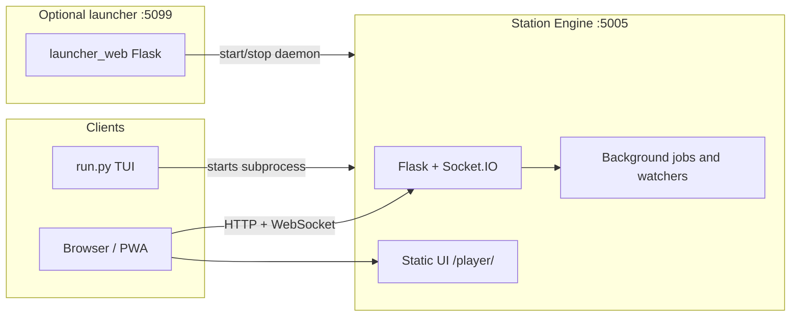

## ARCHITECTURE – System overview

This document describes how the Soundsible repository is structured, which processes run where, and how data flows between components. For deployment and networking details see [INSTALL.md](INSTALL.md); for knobs and env vars see [CONFIGURATION.md](CONFIGURATION.md).

### 1. Mental model

Soundsible is a **self-hosted music environment**: a Python **Station Engine** exposes an HTTP API and real-time events, serves the **Station** web UI, and coordinates library management, playback state, and downloads. A separate optional **web launcher** helps start the legacy daemon from a browser. Optional **CLI** flows use the same engine entry points.

At runtime you typically have one of these engine modes:

- **Legacy daemon** — one process listening on **port 5005** by default (`STATION_PORT` in `shared/constants.py`). It runs Flask, Socket.IO (async mode **gevent**), and background work (download queue, file watchers, optional library sync).
- **Desktop engine** — one process started with `run.py --desktop-engine` or `soundsible_engine.py`. It binds to **`127.0.0.1` on a random free port by default**, writes runtime state under the app config dir, and emits a single JSON readiness line on stdout before normal startup logs.
- **Web launcher** — optional Flask app on **port 5099** (`start_launcher.py` / `launcher_web/`). It does **not** serve the player; it only helps start or stop the engine and run first-time setup UI.

The **Station** UI is a responsive SolidJS application under `ui_web/`, served by the engine at **`/player/`** and **`/player/desktop/`**. Both routes use the same frontend; the desktop route additionally receives the owner-token bootstrap required by the desktop shell. The UI talks to the engine over REST and WebSocket (Socket.IO).

### 2. Repository layout (high level)

| Area | Role |
|------|------|
| `run.py` | Universal entry: venv bootstrap, optional **TUI** menu, legacy **`--daemon`**, or desktop **`--desktop-engine`**. |
| `soundsible_engine.py` | Standalone desktop engine entrypoint that wraps `run.py --desktop-engine`. |
| `shared/` | Cross-cutting code: Flask API app (`shared/api/`), models, config paths, security helpers, SQLite access, job orchestration. |
| `player/` | Library manager, queue, favourites, cache — **core playback and library** logic used by the API. |
| `ui_web/` | SolidJS + TypeScript Station frontend and Vite build; includes **Discover** (Deezer metadata + YouTube resolution). |
| `launcher_web/` | Small Flask app for the launcher pages and “launch/stop ecosystem” API. |
| `odst_tool/` | Download pipeline (yt-dlp, FFmpeg), ODST library format, cloud sync helpers; embedded in the API for downloads. |
| `setup_tool/` | Storage providers (local, S3-compatible), scanning, uploads, audio/cover helpers used by library and sync paths. |

### 3. Process and network view



- **Starting the legacy daemon**: `shared/daemon_launcher.py` spawns `venv` Python with `run.py --daemon`, which calls `shared.api.start_api()` and binds **0.0.0.0:5005**.
- **Starting the desktop engine**: `soundsible_engine.py` or `run.py --desktop-engine` builds a `RuntimeConfig`, creates a short owner token file plus matching scoped auth token, writes `desktop-engine-state.json` under the config dir, and then starts `shared.api.start_api()` on loopback.
- **CORS**: REST CORS defaults allow localhost, private LAN, and Tailscale-style ranges unless overridden by `SOUNDSIBLE_ALLOWED_ORIGINS`. Socket.IO CORS can be tightened with `SOUNDSIBLE_SOCKET_CORS_ORIGINS`.

### 4. Station Engine internals

The Flask application lives in `shared/api/__init__.py`. It:

- Registers blueprints for **library**, **playback**, **downloader**, **config**, **discovery**, **podcasts**, and **agent** (`shared/api/routes/`).
- Serves the web player under `/player/`: prefers the `ui_web/dist` build when present, falling back to the `ui_web` source tree (override with `SOUNDSIBLE_WEB_UI_DIST=0/1`).
- Holds singletons for **LibraryManager**, **QueueManager**, **FavouritesManager**, and the download subsystem.
- Uses **Socket.IO** for live updates (e.g. library changes, downloader progress, playback coordination).

**Desktop sidecar contract**:

- The desktop engine emits one newline-delimited JSON readiness event on stdout with `base_url`, `host`, `port`, `pid`, `version`, `health`, and `owner_token_file`.
- Runtime state is mirrored to `desktop-engine-state.json` in the config dir so a future desktop shell can stop only the owned process by PID instead of killing by port.
- `GET /api/health` returns runtime directories, uptime, owner token file path, library stats, and active background-job state for shell diagnostics.
- `/player/desktop/` now receives the owner token through HTML bootstrap injection (`meta` + `window.__SOUNDSIBLE_OWNER_TOKEN__`) so the desktop player can call owner-protected routes without query-string hacks.

**Pairing primitives**:

- Owners create short-lived pairing sessions with **`POST /api/pairing/sessions`** and can inspect them with **`GET /api/pairing/sessions`**.
- Session payloads now include QR-ready connection metadata: candidate LAN base URLs, claim/player URLs, and a compact JSON `qr_text` payload suitable for encoding directly into a QR code.
- Clients claim a visible pairing code through **`POST /api/pairing/sessions/claim`**.
- Owners complete or cancel the flow through **`POST /api/pairing/sessions/<id>/confirm`** and **`POST /api/pairing/sessions/<id>/cancel`**.
- The shell can explicitly mark the QR sheet open or closed through **`POST /api/pairing/sessions/<id>/display-open`** and **`POST /api/pairing/sessions/<id>/display-close`**. If `auto_confirm` is enabled while display is open, a claim can complete immediately without a second owner round-trip.
- Successful confirmation creates a scoped `paired_device` bearer token in `auth_tokens`; owners can list and revoke those tokens with **`GET /api/paired-devices`** and **`POST /api/paired-devices/<token_id>/revoke`**.
- The engine exposes this flow, but wiring it into the SolidJS Settings view remains a
  `new-ui` parity task before cutover.

**Job orchestration** (`shared/api/orchestrator.py`): a small **JobOrchestrator** serializes metadata writes and runs bounded concurrent work (e.g. downloads) so heavy tasks do not stampede the library.

**Caching and single-flight** (`shared/api/memo.py`): every slow path in the API is a yt-dlp call measured in seconds — text search, stream-URL resolution, related mixes. `Memo` gives them a **bounded** TTL cache plus **single-flight**: concurrent callers for one key collapse onto whichever arrived first and share its result. This matters because a TTL cache alone only helps *after* the first call returns; while it is in flight the entry is absent, so N simultaneous requests for the same thing each pay full price. That is exactly the shape of a listener tapping a preview repeatedly, or a speculative prefetch racing the click it was meant to make instant. Used by:

| Path | TTL | Notes |
|------|-----|-------|
| `_get_preview_stream_url_cached` (playback) | 5 min, 20 s negative | An unresolvable video is remembered briefly so a retry storm is not a yt-dlp storm. |
| `_resolve_candidates` (catalog) | 30 s | In-flight window only; the durable cache is SQLite `get_cached_resolution`. |
| `youtube/search`, `youtube/peek`, `youtube/related` (downloader) | 5 min / 1 min / 5 min | `related` also re-checks the persistent SQLite cache inside the flight. |

Catalog resolve queues the winner's stream-URL resolution on the **preview prefetch worker** rather than blocking the response on it: the click that follows either finds the URL warm or joins the extraction already running.

**Download path**: queued items are processed in the background; completed tracks are merged into the main library metadata (`_sync_odst_to_main_core` and related helpers). A catalog Recording MBID crosses the queue as acquisition evidence, is stored on the track and is embedded using MusicBrainz Picard's standard MP3/FLAC tag mapping; folder scans recover the same identifier from supported tagged files. FFmpeg and yt-dlp are used via `odst_tool/`.

**Library path**: `player/library.py` loads each account's canonical **`library.db`** and **`~/.config/soundsible/config.json`** for `PlayerConfig`; it can also use storage providers from `setup_tool/` for cloud-backed exports. One SQLite transaction stores the complete library snapshot: ordered tracks and playlists, settings, podcast state, normalized `artists`/`albums`/`track_artists`, and `track_user_state`. Entity IDs are deterministic and albums include their album artist, so unrelated records with the same title do not collapse. After that transaction commits, Soundsible atomically refreshes `library.json` as a portable export; an export failure does not roll back the library.

Each track carries **`added_at`**, the day the song joined *this* library — set by every acquisition path, carried across a re-keyed id, and never rewritten once stored. It is what "recently added" means in the player, in `getAlbumList2`'s `newest`, and in a Subsonic album's `created`. A library from before the column existed is dated once, on open, from each file's own mtime, falling back to its position in the manifest for a file that cannot be reached; `last_updated` is deliberately not used, because every row carries the instant of the last rewrite. The player merges files with saved-but-not-downloaded songs on this one field, which is the only way a library that holds both can be ordered by anything but which list a song happens to be in.

`POST /api/library/scan` queues an account-scoped scan on the orchestrator's
disk-limited background lane. It reads the configured music roots in place and
merges its delta against the newest SQLite revision under the serialized
metadata lock, so a scan cannot overwrite a concurrent download. Absolute
paths and file mtimes remain machine-local SQLite fields and are excluded from
`library.json`. Playback accepts them only while their resolved targets remain
inside a currently configured root. Rescans add or re-key files but never purge
missing ones; removal remains an explicit maintenance action.

**Catalog browsing**: `shared/api/routes/library_catalog.py` serves
`/api/library/albums`, `/api/library/artists`, `/api/library/genres` and
`/api/library/years` from that same normalized projection, so the player browses
the records and credits `/rest` browses rather than regrouping the flat manifest
in the browser — which made a display string into a performer and merged two
records that share a title. Album orderings are validated against
`DatabaseManager.ALBUM_ORDERINGS`, the table `getAlbumList2` orders by, so the
two surfaces cannot disagree about what "by year" means. Entities answer with
track ids: the player already holds every track it can play, keyed by id, with
its favourite mark and loudness reading attached.

An account without a canonical marker is migrated once using the previous manifest precedence. Its config-dir manifest is preserved as `library.json.pre-sqlite.bak`; fresh accounts receive an empty canonical database. After migration, JSON edits and mtimes are ignored: other writers are observed through the SQLite revision, and `/api/library/sync` reloads SQLite and regenerates the exports.

**OpenSubsonic path**: `shared/api/routes/subsonic.py` serves `/rest`, reading that same catalog and serving bytes through the path `/api/static/stream` uses. `shared/subsonic/` holds what the views decide with: the XML/JSON/JSONP envelope, the per-account credential (encrypted, because the protocol's `md5(password + salt)` handshake cannot be checked against a hash), the `Child`/`AlbumID3`/`ArtistID3` serializers, and the ffmpeg transcode. This surface is **outside `/api`**, so the `before_request` hook leaves it anonymous and it authenticates itself — with no trusted-network shortcut, since it can be reached through a funnel. See [OpenSubsonic](OPENSUBSONIC.md).

**Device registry and handoff**:

- Clients register with **`POST /api/devices/register`** using `device_id`, `device_name`, and `device_type` (`mobile`, `desktop`, or `agent`). The registry is process-local and scoped through the same playback scope resolver as playback state.
- Socket.IO clients still join **`playback:{scope}:{device_id}`** rooms through `playback_register`; that event also refreshes the registry for existing web clients.
- Playback state remains isolated by `scope` and `device_id`. Clients publish state with **`PUT /api/playback/state`** and stop requests use **`POST /api/playback/notify-stop`**.
- **`POST /api/playback/handoff`** reads the source device state, emits `playback_stop_requested` to `playback:{scope}:{from_device_id}`, writes the target device state with the existing playback-state helper, and emits `playback_start_requested` to `playback:{scope}:{to_device_id}`. It does not broadcast across scopes or unscoped rooms.

**Agent API**:

- Agent tokens are created with **`POST /api/agent/token`**. This route is admin-protected using the same policy as other admin routes (`SOUNDSIBLE_ADMIN_TOKEN` when configured, otherwise trusted LAN/Tailscale compatibility).
- Scoped auth tokens are stored in SQLite `auth_tokens` as hashes only. The desktop engine uses an `owner` token, and agents use scoped `agent` tokens. Legacy agent routes still preserve compatibility with the older `agent_tokens` table.
- Agents authenticate with `Authorization: Bearer <token>` or `X-Soundsible-Agent-Token`.
- **`GET /api/agent/verify`**, **`POST /api/agent/play`**, and **`POST /api/agent/command`** require `@require_agent_token`.
- Agent control targets a supplied `device_id` or the most recently registered non-agent device in the current scope. Commands emit to `playback:{scope}:{device_id}` rooms and reuse playback state for `play`/handoff-style starts.

**Search discovery feed and providers** (`shared/api/routes/discovery.py`,
`shared/discovery_intelligence.py`):

- The browser cannot call `api.deezer.com` (CORS). The Station exposes **`GET /api/discovery/deezer/<path>`**, which forwards **allowlisted** Deezer paths only (e.g. `chart`, `search`, `playlist/<id>`, `track/<id>`, `artist/<id>/top`) and returns Deezer’s JSON unchanged.
- Requests are **rate-limited** per IP (`discovery_deezer`). The engine needs **outbound HTTPS** to Deezer.
- **`GET /api/discovery/music/feed`** is an internal ranked discovery contract. It
  assembles local-library,
  favourite, playlist, listening-history, Deezer, and cached YouTube-related
  candidates; the server then ranks sections, diversifies artists, and removes
  cross-section duplicates. A local result is returned without waiting for
  provider extraction, while the fuller response is refreshed in the
  background and served stale-while-revalidate.
- Playback discovery pools can consume that contract without changing the
  existing **Search** presentation. **Library** remains the root route.
- **`POST /api/discovery/music/plan`** is the generated-listening contract for
  Autoplay, Radio, and Auto Mode. The Station assembles playable local,
  seed-related, cached graph, and artist candidates, applies the account
  profile, diversity, exclusions, and intent/profile policy, then returns the
  final ordered segment. A single browser coordinator owns cancellation,
  retries, and refill; it never re-ranks the server response.
- Radio remains the explicit “more of this now” mode and continuously refills.
  Auto Mode uses the v6 compositional contract: route occurrences determine
  what will sound, while visible ephemeral sources independently steer the
  generated runway. Sources accumulate with recency decay; heard tracks provide
  rolling one-hop context only after they actually sound. Exact placement and
  exclusions remain session-local, with no waypoint state or hard musical
  boundary. The director builds an energy arc from signal analysis and
  stochastic graph walks; it does not use an LLM or silently apply the
  account's global taste profile.
  Autoplay remains an invisible finite-context continuation. Search does not
  use the queue planner and its UI is unchanged.
- **Playback and downloads** for those rows do **not** use Deezer audio. The UI runs **YouTube / YouTube Music text search** (same ODST `/api/downloader/youtube/search` path as the downloader) using Deezer title + artist, picks a matching video id, then:
  - **In-app preview** streams via **`GET /api/preview/stream/<video_id>`** (playback blueprint).
  - **Download queue** uses the resolved item like any other ODST search result.
- Resolution can take a few seconds; the download-queue popover may show a short **“Finding YouTube match…”** state while that search runs.

**Universal search** (`shared/api/routes/catalog.py`):

- `GET /api/catalog/search` runs library, Deezer, MusicBrainz, and plain
  YouTube providers concurrently and returns one deterministically ranked mixed
  list. Provider failures are reported as partial failures; surviving results
  remain usable.
- Ranking is query-only. It never reads recommendation signals, favourites, or
  account preferences, including for tie-breaking. Ownership is an action-state
  badge, not a rank boost.
- **The server owns the layout.** The response carries `top_result` (an item id
  or `null`) and an ordered `sections` list of
  `{id, layout, item_ids, total}` — `layout` is one of
  `hero | rows | grid | grid_round`, and `total` is the pre-cap count so a client
  can offer "see all N" without asking again. Section order is part of the
  answer: an artist-name query leads with artists, an album name with albums.
  Every search surface renders that one order (`ui_web/src/lib/searchSections.ts`);
  the Search route and the Now Playing panel used to hardcode two different ones.
  Clients send `type=all` and filter tabs locally — a `type=artist` request costs
  a full provider fan-out for a strictly smaller answer.
- **`top_result` is gated, not just "the first row".** It is emitted only above a
  score floor, and an artist or album additionally has to beat the best row of a
  different type by a margin — otherwise the type boost alone decided it, which
  is not evidence. No card is better than a wrong one: it is the largest target
  on the page and, for an entity, it navigates away.
- **Ranking signals**, all derived from the query plus the rows the providers
  just returned: tiered title/artist matching over accent-folded text
  (`shared/text_utils.fold_text`) with order-free token matching; a coverage
  factor so a title the query nearly fills outranks a long one it merely prefixes
  (release boilerplate is stripped first, so `(Official Video) [HD]` costs
  nothing); popularity ranked *within* each `(source, type)` cohort and bounded
  below the smallest text tier, since raw popularity is incomparable across
  providers and a source that publishes none scores the neutral midpoint; a
  corroboration bonus when several providers name the same entity; and an
  artist/album intent bonus when a quorum of the top songs share one name that
  also matches the query.
- Rows from different providers that resolve to the same recording collapse into
  one. The surviving row and its position are chosen by query-only score;
  ownership only merges into the survivor's action state, so an owned copy makes
  the row instantly playable without moving it up the page. Rows whose durations
  disagree by more than a few seconds are treated as different cuts and stay
  separate. YouTube rows are excluded from title-based collapsing, because their
  titles embed the artist and the parse that would match them is the change most
  likely to hide the exact row somebody was looking for.
- Repeated public creator results may supply a one-edit intent correction
  (`fari` → `El Fary`). Literal matches remain in the response.
- Search, artist and album bodies are cached in `Memo` (`shared/api/memo.py`),
  which is bounded *and* single-flight: concurrent callers for one query collapse
  onto one fan-out instead of each running their own. Keys are account-scoped
  because the bodies carry `in_library` state.

**Local recommendation profile** (`shared/discovery_intelligence.py`,
`shared/database.py`):

- Each account has transactional `discovery_events` and
  `discovery_signals` tables in its own `library.db`, plus an inspectable local
  `listening-events.jsonl`.
- Discovery, Radio, Auto Mode, Autoplay, and podcast recommendations use the same exact
  identity multiplier. `not_interested` is soft, monotonic, undoable, and
  bounded above zero; it never becomes a blacklist. Search and manual queues do
  not call this ranker.

### 4A. Playback loading contract (client)

The engine cannot make a cold preview instant — there is a yt-dlp extraction behind it — so the UI is built to make the wait *legible and idempotent* rather than pretend it is not there. Three rules, all in `ui_web/src/stores/index.ts` and `ui_web/src/lib/audio.ts`:

- **Idempotent.** `loadIndex` treats a request for the entry that is already active as a no-op (or a resume, if paused). Repeated taps on a row cost nothing; only `{ restart: true }` replays from 0:00. `playCatalogItem` (`lib/catalogItem.ts`) does the same for rows that still need resolving.
- **Last click wins.** Assigning `src` aborts the previous fetch, and `audio.ts` tags each attempt with a sequence number so the superseded `play()` rejection — an `AbortError` — is swallowed instead of being reported as the new track failing. `audioService.stop()` (teardown, not pause) clears `src` so the engine stops streaming bytes nobody is listening to.
- **Visible.** `playback.isLoading` / `playback.loadError` drive a spinner and an indeterminate progress sweep in the OmniBar and the Now Playing transport, a retry affordance on failure, and a spinner on the specific row that was tapped. A failed track auto-advances, bounded to 3 consecutive skips.

A failed load surfaces on two channels (`play()` rejects **and** the element fires `error`), so failure reporting is keyed by a load generation — the first report retires the attempt and the duplicate is ignored.

### 4B. Playback queue contract (client)

The Solid player uses occurrence-based manual, context, and generated lanes.
Its single generated-session coordinator and the ordering, replacement,
shuffle, Radio, Auto Mode, and Autoplay semantics are normative in
[`PLAYBACK_QUEUE_CONTRACT.md`](PLAYBACK_QUEUE_CONTRACT.md).

### 5. Data and configuration (conceptual)

One engine serves **several accounts**. State splits in two: what belongs to the
machine, and what belongs to a person.

**Instance-level** (one copy, admin-managed):

| Location | Purpose |
|----------|---------|
| `<config>/instance.db` | Accounts, credentials (`auth_tokens`, `agent_tokens`), pairing sessions, and the content-addressed caches everyone shares (YouTube resolution, related mixes, lyrics). |
| `<config>/config.json` | Storage backend and credentials (`PlayerConfig`). |
| `<config>/output_dir`, `<config>/music_dir.json` | Where the shared music pool lives. |
| `<config>/cookies.txt` | yt-dlp cookies. |
| `<config>/download_queue.json` | One queue; each row carries `user_id`. |
| `<music>/tracks/<hash>.<ext>` | **Shared audio pool.** The track id *is* the content hash, so two people who own the same song point at the same file — nothing is downloaded or stored twice. |
| `<music>/library.json` | Instance catalog of what is physically on disk (written by ODST). |
| `<cache>/previews/`, `<cache>/covers/` | Shared, content-addressed. |
| `<data>/telemetry/` | `setup-events`, `migration-events`. |

**Per account**, under `<config>/users/<user_id>/` and `<data>/users/<user_id>/`:

| File | Purpose |
|------|---------|
| `library.db` | Canonical library: ordered tracks and playlists, settings, podcast state, normalized artist/album catalog, per-track state, and machine-local scan paths/fingerprints. |
| `library.json` | Portable export of your canonical library for recovery and cloud interoperability. The first migration also keeps `library.json.pre-sqlite.bak`. |
| `favourites.json`, `playback_state.json`, `discovery_settings.json` | Saved songs, cross-device resume, discovery opt-in. |
| `queue_state.json` *(data dir)* | Playback queue. |
| `telemetry/listening-events.jsonl`, `telemetry/play-timing.jsonl` *(data dir)* | Listening history — the input to *your* recommendations. |

Editing a track's tags re-encodes the file and therefore changes its hash, which
mints a new track id. That is what keeps metadata edits private: your manifest
follows the new id while everyone else keeps the original.

**Favourites are identity-keyed, not id-keyed.** `favourites.json` (v2) holds
ordered entries, newest first:

```json
{"version": "2.0", "favourites": [
  {"keys": ["lib:9f2a…", "yt:dQw4w9WgXcQ"], "title": "…", "artist": "…",
   "duration": 355, "thumbnail": null, "added_at": "…"}
]}
```

`keys` is the set of namespaced identities the song answers to — the same
namespaces the player uses to track a song across hops (`lib:`, `yt:`, `isrc:`,
`mb:`, `deezer:`, `cat:`; see `ui_web/src/lib/playbackIdentity.ts`). Two entries
are the same song when their key sets intersect. That is what lets you save a
song you have not downloaded: the snapshot renders and streams it on its own,
and the entry is resolved against the library *at read time*, so downloading it
later promotes the same entry to the owned track with nothing rewritten. v1
files (a flat array of track ids) migrate on load. Key derivation lives in the
client; `player/favourites_manager.py` only stores, orders and intersects.

Exact filenames and fields may evolve; treat the code under `shared/` and `player/` as the source of truth.

### 5A. Accounts, sessions, and the identity gate

- **Accounts** live in `shared/users.py` (policy) over the `users` table. Roles are
  `admin` and `member`. Passwords are scrypt hashes (`werkzeug.security`).
- **Sessions** are opaque 32-byte tokens stored *only as SHA-256 hashes* in
  `auth_tokens` with `kind='session'` and a `user_id`, delivered as an HttpOnly
  `sb_session` cookie. The cookie rides along with the Socket.IO handshake, so
  real-time auth is free.
- **`instance_requires_login()`** is the switch. It is `False` in exactly one
  case — a single account with no password, which is what a migrated single-user
  install looks like — and `True` from the moment a second account exists or the
  only account gets a password.
- **One gate, not 126 decorators.** `before_request` in `shared/api/__init__.py`
  resolves the caller, returns **401** for any `/api/*` outside a small public
  allowlist (`/api/auth/state`, `/api/auth/login`, `/api/auth/logout`,
  `/api/health`, `/api/pairing/sessions/claim`), and binds the user for the rest
  of the request. Managers underneath resolve their paths through that binding
  (`shared/user_context.py`), and asking for a user directory with nobody bound
  raises rather than silently falling back.
- **Scopes**: members hold `library:read`, `library:write`, `playback:control`,
  `download:add`, `admin:config` (their own preferences). Admins additionally hold
  **`admin:instance`** — music folder, storage backend, downloader tuning,
  optimization, cloud sync, and account management — plus `admin:dangerous`.
- **Real-time isolation**: each socket joins a `user:{user_id}` room;
  `library_updated` and `downloader_*` are emitted there, never broadcast.
  Playback rooms stay `playback:{scope}:{device_id}` where the scope is the user id.
- **Migration** (`shared/multiuser_migration.py`) runs on every boot and is
  idempotent. On a pre-multiuser install it creates the admin account, moves the
  flat state under `users/<id>/`, copies the instance tables out of the old
  `library.db` (so paired devices and warm caches survive), and leaves the
  originals renamed `*.singleuser.bak`.

### 6. Security notes (brief)

- **Path and network hardening** live in `shared/security.py` and `shared/hardening.py` (e.g. admin actions on the launcher, rate limits, response headers).
- Playback registration uses scoped Socket.IO rooms so stop/resume semantics stay consistent across tabs/devices where implemented.
- REST CORS is controlled by `SOUNDSIBLE_ALLOWED_ORIGINS`; include mobile app origins there when they are not covered by the default localhost/LAN/Tailscale patterns. Agent requests may use `Authorization` or `X-Soundsible-Agent-Token`, both allowed by API CORS.

### 7. Related documentation

- [INSTALL.md](INSTALL.md) — headless operation, reverse proxy, Tailscale.
- [VPS_RELAY.md](VPS_RELAY.md) — verified private residential egress for bot-blocked VPS hosts.
- [AGENT_INTEGRATION.md](AGENT_INTEGRATION.md) — API guide for OpenClaw, Hermes agents, and local assistants.
- [CAR_INTEGRATION.md](CAR_INTEGRATION.md) — car media surfaces, `/api/car/*`, and native companion contract.
- [CONFIGURATION.md](CONFIGURATION.md) — configuration surfaces and environment variables.
- [troubleshooting-yt-dlp-formats.md](troubleshooting-yt-dlp-formats.md) — yt-dlp format issues when using cookies.
- [LEGAL.md](LEGAL.md) — acceptable use.
